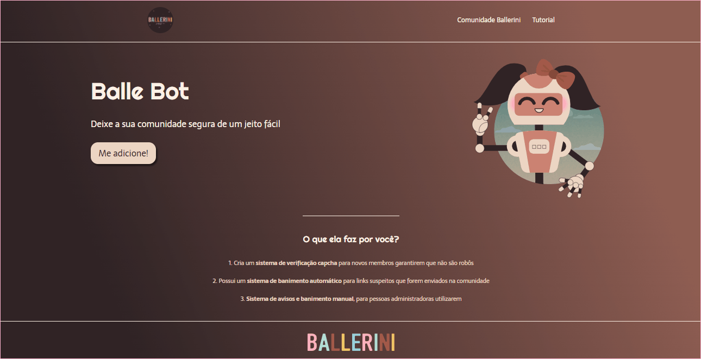
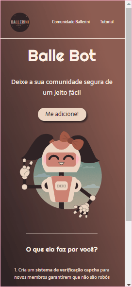

<h1 align="center">
  
</h1>

Este projeto de Landing Page foi feito apenas com HTML e CSS. Nesse caso, utilizamos o projeto Figma da Balle Bot criado pela Rafaella Ballerini, um robô que modera a comunidade no Discord, que inclusive está aberto para qualquer pessoa que queira participar =) O link está na própria Landing Page criada, na seção navegação.

 [👀 Visualize o projeto clicando aqui](https://revertemayene.github.io/landingpage-ballebot/)

 

 

## 🖥️ Prévia para Desktop

✨ Projeto desktop desenvolvido utilizando o design do Figma.

 
<h1 align="center">

  

  
</h1>

## 📱 Prévia para Mobile

✨ Projeto mobile desenvolvido por minha própria vontade, pois não foi disponibilizado o design responsivo para mobile.

 
<h1 align="center">

  

  
</h1>

## 🔥 Meus desafios

Meu maior desafio neste projeto foi distribuir o conteúdo em 'class' para a estilização no CSS. A dúvida era porque eu deveria utilizar classes e não as próprias tags do html, mas com muito network, percebi que o entendimento da semântica do código por outros desenvolvedores é muito importante, e o uso de classes ajuda muito neste quesito de organização da estilização.

  

## 🚀 Tecnologias utilizadas

✔️ HTML5

✔️ CSS3

  

Feito com o ❤️ por Mayene Reverte [Meu linkedIn](https://www.linkedin.com/in/mayenereverte/)

Criado em março/2022

